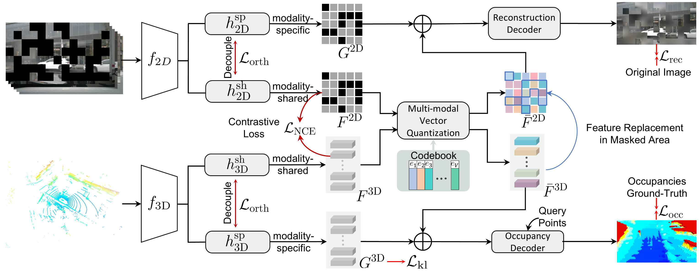

# Is Contrastive Distillation Enough for Learning Comprehensive 3D Representations?

Official PyTorch implementation of the method **CMCR**. More details can be found in the paper:

**Is Contrastive Distillation Enough for Learning Comprehensive 3D Representations?**, IJCV 2026 [[arXiv](https://arxiv.org/abs/2412.08973)]
by *Yifan Zhang, and Junhui Hou*

<!--  -->


<!-- ## Dependencies

Please install the required required packages. Some libraries used in this project, including MinkowskiEngine and Pytorch-lightning are known to have a different behavior when using a different version; please use the exact versions specified in `requirements.txt`. -->

Abstract: Cross-modal contrastive distillation has recently been explored for learning effective 3D representations. However, existing methods focus primarily on modality-shared features, neglecting the modality-specific features during the pre-training process, which leads to suboptimal representations. In this paper, we theoretically analyze the limitations of current contrastive methods for 3D representation learning and propose a new framework, namely CMCR (Cross-Modal Comprehensive Representation Learning), to address these shortcomings. Our approach improves upon traditional methods by better integrating both modality-shared and modality-specific features. Specifically, we introduce masked image modeling and occupancy estimation tasks to guide the network in learning more comprehensive modality-specific features. Furthermore, we propose a novel multi-modal unified codebook that learns an embedding space shared across different modalities. Besides, we introduce geometry-enhanced masked image modeling to further boost 3D representation learning. Extensive experiments demonstrate that our method mitigates the challenges faced by traditional approaches and consistently outperforms existing image-to-LiDAR contrastive distillation methods in downstream tasks.

## Datasets

The code provided is compatible with [nuScenes](https://www.nuscenes.org/lidar-segmentation) and [semantic KITTI](http://www.semantic-kitti.org/tasks.html#semseg). Put the datasets you intend to use in the datasets folder (a symbolic link is accepted).


<!-- ## Pre-trained models

### Minkowski SR-UNet
[SR-UNet pre-trained on nuScenes](https://github.com/valeoai/SLidR/releases/download/v1.0/minkunet_slidr_1gpu.pt)

### SPconv VoxelNet
[VoxelNet pre-trained on nuScenes](https://github.com/valeoai/SLidR/releases/download/v1.0/voxelnet_slidr.pt)

[PV-RCNN finetuned on KITTI](https://github.com/valeoai/SLidR/releases/download/v1.0/pvrcnn_slidr.pt) -->

## Instruction


### Pre-training a 3D backbone

To launch a pre-training of the Minkowski SR-UNet (minkunet) on nuScenes:

```python pretrain.py --cfg config/ppkt_minkunet.yaml```

You can alternatively replace minkunet with voxelnet to pre-train a PV-RCNN backbone.  
Weights of the pre-training can be found in the output folder, and can be re-used during a downstream task.
If you wish to use multiple GPUs, please scale the learning rate and batch size accordingly.

### Semantic segmentation

To launch a semantic segmentation, use the following command:

```python downstream.py --cfg_file="config/semseg_nuscenes.yaml" --pretraining_path="output/pretrain/[...]/model.pt"```

with the previously obtained weights, and any config file. The default config will perform a finetuning on 1% of nuScenes' training set, with the learning rates optimized for the provided pre-training.

To re-evaluate the score of any downstream network, run:

```python evaluate.py --resume_path="output/downstream/[...]/model.pt" --dataset="nuscenes"```

If you wish to reevaluate the linear probing, the experiments in the paper were obtained with `lr=0.05`, `lr_head=null` and `freeze_layers=True`.


### Object detection

All experiments for object detection have been done using [OpenPCDet](https://github.com/open-mmlab/OpenPCDet).

## Acknowledgment

Part of the codebase has been adapted from [SLidR](https://github.com/valeoai/SLidR).

## License
CMCR is released under the [Apache 2.0 license](./LICENSE).

If you use CMCR in your research, please consider citing:
```
@InProceedings{CMCR,
    author    = {Yifan, Zhang and Junhui, Hou},
    title     = {Is Contrastive Distillation Enough for Learning Comprehensive 3D Representations?},
    booktitle = {International Journal of Computer Vision},
    year      = {2026}
}
```
